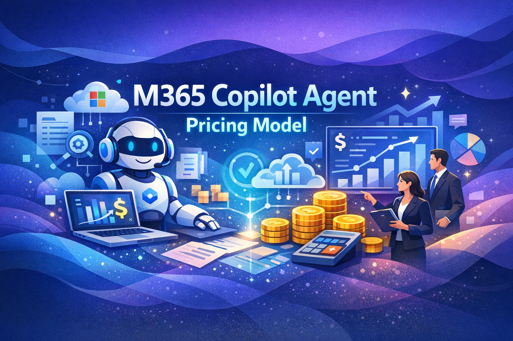

# Copilot Agent Pricing Model — Break-Even Analysis

Interactive tool for comparing **consumption-based pricing** vs **per-user per-month (PUPM) licensing** for Microsoft 365 Copilot agents.

**[→ Try it live](https://prestonpeine.github.io/copilot-agent-pricing/)**

See also: [Official Microsoft Copilot Studio Estimator](https://microsoft.github.io/copilot-studio-estimator/)

## What It Does

This single-page calculator helps organizations model the cost of AI agent usage across different user personas and find the break-even point between two pricing approaches:

- **Consumption-based**: Pay per session based on agent complexity (turns × cost per turn × composition mix)
- **Per-user license (PUPM)**: Flat monthly fee per user regardless of usage

It then recommends the **optimal pricing mix** — consumption for some groups, PUPM for others — to minimize total organizational cost.

## The 4-C Framework

Costs are modeled using four dimensions:

| Dimension | Question |
|---|---|
| **Cadence** | How many agent sessions per month? |
| **Conversation** | How many back-and-forth turns per session? |
| **Computation** | What's the cost per turn (based on model + grounding)? |
| **Composition** | What mix of agent types does each user group use? |

## Agent Types (Defaults)

| Agent | Turns/Session | Cost/Turn | Cost/Session |
|---|---|---|---|
| Information Retrieval | 3 | $0.12 | $0.36 |
| Task Agent | 6 | $0.12 | $0.72 |
| Analyst Agent | 10 | $0.20 | $2.00 |
| Strategy Agent | 16 | $0.30 | $4.80 |

Cost/turn is calibrated from Copilot Credits at $0.01/credit using published credit rates.

## User Groups (Defaults)

| Group | Users | Sessions/Mo | Top Agent Mix |
|---|---|---|---|
| Frontline Worker | 2,000 | 25 | 50% Info, 35% Task |
| Information Worker | 1,500 | 45 | 35% Task, 30% Analyst |
| Manager | 200 | 35 | 40% Analyst, 30% Strategy |
| Executive | 25 | 25 | 55% Strategy, 30% Analyst |

## Features

- **Real-time break-even chart** — see where each user group crosses the PUPM line
- **Adjustable PUPM** — slide from $1–$30 to model different license prices
- **Agent configuration** — tune turns and cost/turn for each agent type (collapsed by default with summary chips)
- **Composition sliders** — auto-normalizing mix percentages per user group
- **Cadence slider always visible** — adjust sessions/month without expanding the group accordion
- **Organization Cost Summary** — enter user counts to see pure consumption, pure PUPM, and optimal mix costs
- **Optimal mix recommendation** — per-group advantage badges and a recommended column showing the cheapest model for each group, with annual savings calculation
- **Blended approach guidance** — recommendation box shows whether to use all consumption, all PUPM, or a named per-group blend
- **Dark mode** — toggle between Light, Dark, and System (auto-detect) themes; persisted in localStorage
- **Persistent state** — all settings (PUPM, agents, groups, user counts) saved in localStorage
- **Fully client-side** — no server, no data leaves your browser

## Running Locally

Just open `index.html` in any modern browser. No build step or dependencies to install.

## Credits

Maintained by Preston Peine. Based on [Mark Hodge's original work](https://bluemaven.github.io/sharepoint-react-poc/).

## License

[MIT](LICENSE)
